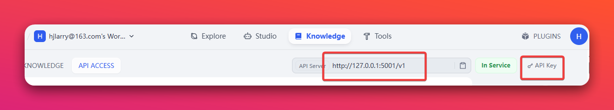
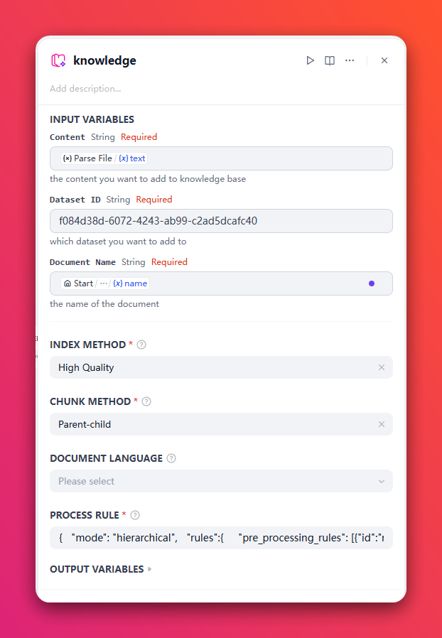
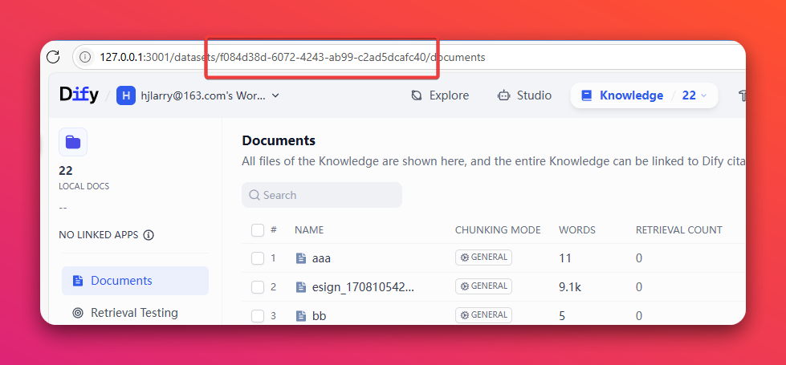
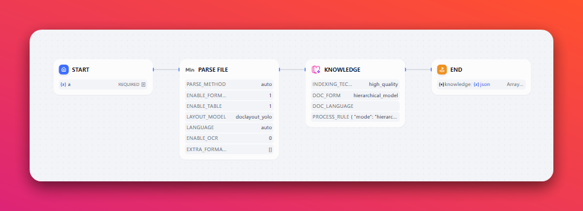

# knowledge

**Author:** hjlarry  
**Version:** 0.0.2  
**Type:** tool  
**Repo:** [https://github.com/hjlarry/dify-plugin-knowledge](https://github.com/hjlarry/dify-plugin-knowledge)  

## Get Started

### 1. Authorization

The API_URL and API_KEY are comes from here:



### 2. Config



The Dataset ID is from here:



the `PROCESS RULE` can be default `{"mode": "automatic"}`, but when you want to custom your process rules, you can config like this:

When your `CHUNK METHOD` is `General` or `Q&A`, the `PROCESS RULE` should be like this:
```json
{
  "mode": "custom",
  "rules":{
    "pre_processing_rules": [{"id":"remove_extra_spaces", "enabled": true}, {"id":"remove_urls_emails", "enabled": true}],
    "segmentation": {
      "separator": "\n\n",
      "max_tokens": 1024,
      "chunk_overlap": 50
    }
  }
}
```

When your `CHUNK METHOD` is `Parent-child`, the `PROCESS RULE` should be like this:
```json
{
  "mode": "hierarchical",
  "rules": {
    "pre_processing_rules": [
      {
        "id": "remove_extra_spaces",
        "enabled": true
      },
      {
        "id": "remove_urls_emails",
        "enabled": true
      }
    ],
    "segmentation": {
      "separator": "\n\n",
      "max_tokens": 1024,
      "chunk_overlap": 50
    },
    "parent_mode": "full-doc",
    "subchunk_segmentation": {
      "separator": "\n\n",
      "max_tokens": 1024,
      "chunk_overlap": 50
    }
  }
}
```

### 3. Run

You can run the plugin like this, follow a PDF parsing plugin like `MinerU`

